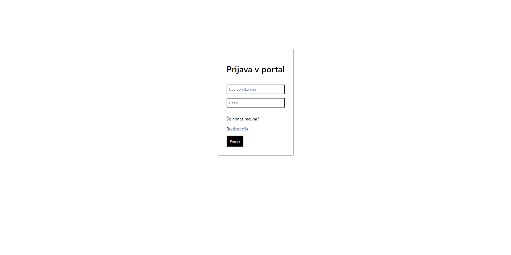
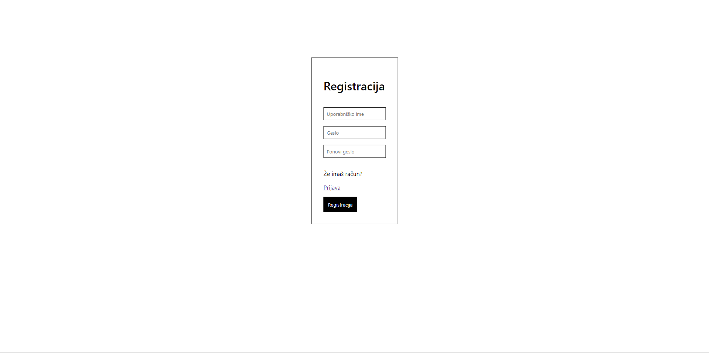
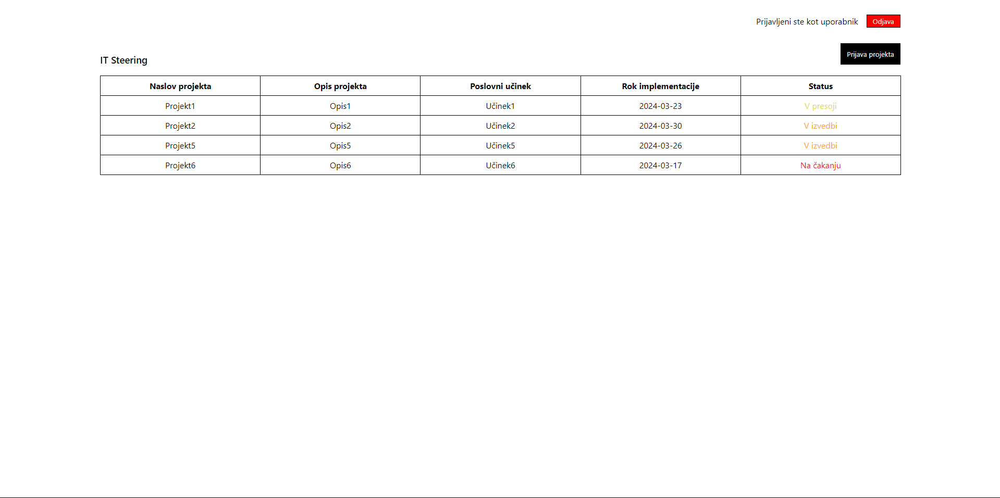
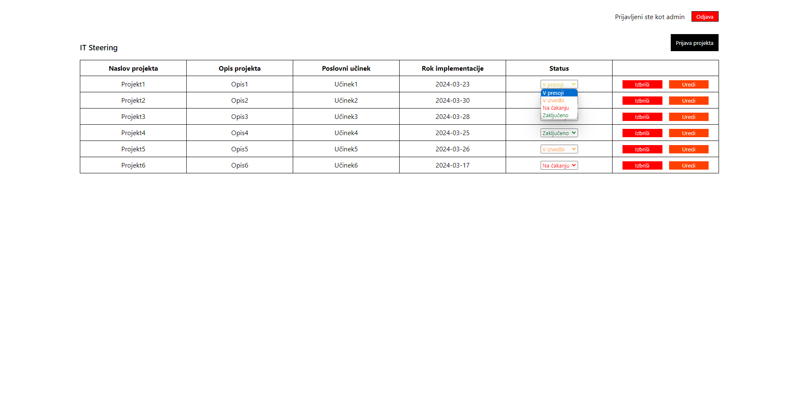
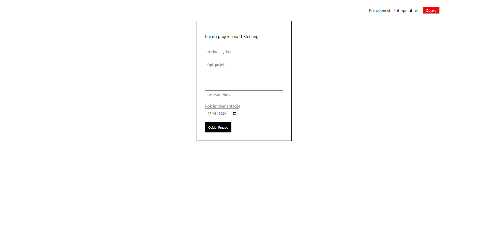

# IT STEERING APP

## Description
App used for creating, submiting and reviewing projects in IT-steering.

As a *user*, you can create a project and submit it to IT-steering.

As an *admin*, you can review projects, change their status or delete them.

## Technologies

- ⚛️[React](https://react.dev) for the frontend.
- 🚅[Express](https://expressjs.com/) for the *node.js* API.
  - 🔗 [Mongoose](https://mongoosejs.com/) for the database connection.
  - 🔑 [JWT](https://jwt.io/) authentication.
- 🍃[MongoDB](https://www.mongodb.com/) for the NoSQL database.

## Installation

### Cloning

Firstly, clone the repository.

### Node modules

Secondly, navigate to */it-steering-api* and */it-steering-app-portal/*, and in both folders run:

```
npm i
```

This command will install all *node modules* specified in **package.json**.

### Environment variables

Your */it-steering-api/* should contain the **.env** for the project to function.

Before running the API, make sure that you have configured the following environment variables:

- `DEV_PORT` *The port on which your API will run (for example 3000)*
- `MONGODB_CONNECTION_STRING` *The connection string you use in order to connect to your **MongoDB** database*
- `JWT_SECRET` *The key used to encrypt your authentication tokens (can be any set of characters)*

## Running the project

### API

Navigate to */it-steering-api* and run the following command:

```
npm run serve
```

This command uses **nodemon** to run your *node.js* server and watch for changes.

In your *terminal*, you should get a message saying that the API server is listening on `DEV_PORT` and that it connected to the database.

### Website

Navigate to */it-steering-app-portal* and run the following command:

```
npm start
```

A browser window should open on *localhost:3000* and the web app should be running.

## How it looks

### Login page



### Register page



### Projects page - User's view



### Projects page - Admin's view



### Create a project page


